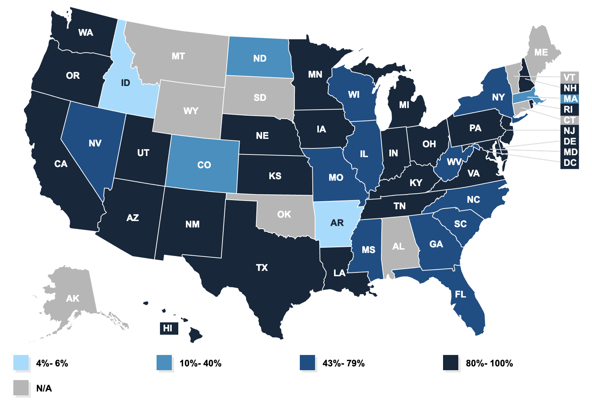

# Research Areas

Our group focuses on a few core research areas within the Medicaid Program. This page provides a brief overview of those topics and provides links to our publications in the area

## Medicaid Managed Care
The overwhelming majority of the Medicaid Program is administered through managed care arrangements in which the government makes standardized payments to private insurers (often for-profit) based on the number of beneficiaries those insurers cover. These insurers take on financial risk and stand to lose or profit if they  administer health care services for more or less than the payments received from the government. 

Because the Medicaid benefit is fairly standardized, these insurers only have a limited set of tools they can use to find efficiencies. For example, federal and state regulations mandate services and drugs that must be covered within Medicaid, which is not the case for the Commercial health insurance market. Further consumer cost sharing (copays, deductibles, co-insurance) is often $0 for Medicaid beneficiaries, or capped at a small amount that cannot be exceeded by any Medicaid plan within the state. 

Given this limited tool set, previous research in this area has focused on:

- Understanding whether Managed Care has actually reduced spending within Medicaid
- Understanding what effects, if any, plans have in this highly constrained market
- Understanding the mechanisms through which plans achieve savings or impact health 

  <a href="https://www.kff.org/medicaid/state-indicator/total-medicaid-mco-enrollment/?activeTab=map&currentTimeframe=0&selectedDistributions=comprehensive-risk-based-managed-care-enrollees&sortModel=%7B%22colId%22:%22Location%22,%22sort%22:%22asc%22%7D">2022 Managed Care Enrollment Rates by State</a>

{: style="height: 550px;width: 800px;display: block; margin: 0 auto"}
    
### Related Publications
- [The Private Provision of Public Services: Evidence from Random Assignment in Medicaid](https://www.nber.org/papers/w30390)
- [What Difference Does a Health Plan Make? Evidence from Random Plan Assignment in Medicaid](https://www.aeaweb.org/articles?id=10.1257/app.20210843)
- [The Impact of Medicaid Managed Care Plan Type on Continuous Medicaid Enrollment: A Natural Experiment](https://pubmed.ncbi.nlm.nih.gov/29952062/)

## Medicaid Providers

## Building A Smarter Safety Net 
