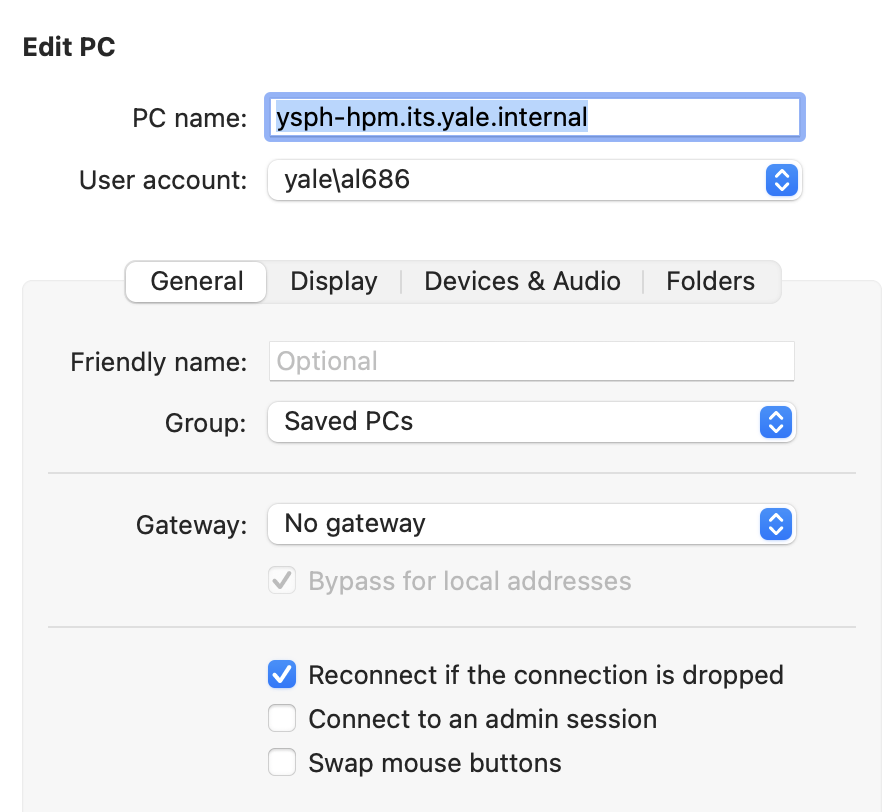
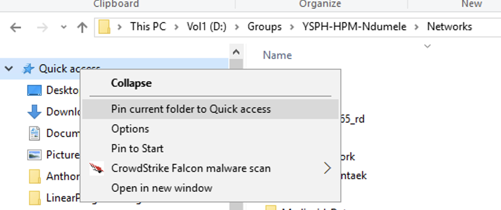

# Connecting to the Server

You will first need to connect to the VPN (Cisco AnyConnect) via access.yale.edu using your netID. Then you can use Microsoft Remote Desktop to log into the server.

## Remote Desktop Configuration

To configure Microsoft Remote Desktop:

- Click "add a PC"
- PC Name: ysph-hpm.its.yale.internal
- User account: yale\your_netID
- Check "Reconnect if the connection is dropped"

{: style="height: 200px;width: 200px;display: block; margin: 0 auto"}

## Navigating to the Project Folder

Due to permissions, you will need to navigate directly to `D:\Groups\YSPH-HPM-Ndumele\Networks\`. You can do this by typing that address directly into the file explorer. Then after navigating there, you can pin this to Quick Access (right click Quick Access and select "Pin current folder to Quick Access") for ease in the future (see image below).

{: style="height: 150px;width: 350px;display: block; margin: 0 auto"}