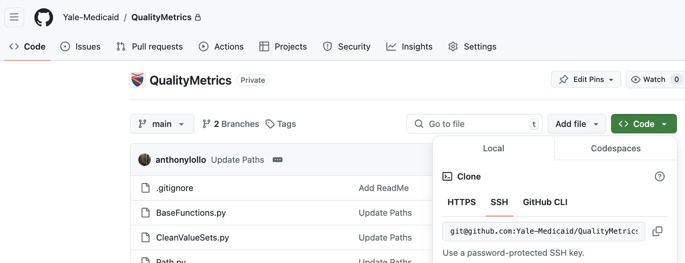

# Coding Collaboration

We will use `git` to collaboratively develop analyses. The most up to date, stable, version of the libraries will be found in `/gpfs/milgram/pi/medicaid_lab/code/` on the main branch, while researcher specific development branches can be stored in your own project directory. 


!!! warning "Always include a .gitignore"

	Code will be pushed remotely to the Yale-Medicaid organization on GitHub. Repositories **must** be initialized with .gitignore files which ignores:
	
	- all common data file extensions (.parquet, .xlsx, .dta, .sas7bdat)
	- files which display data for exploratory analyses (.ipynb)
	- objects that can be used to recreate raw data (.Rdata, targets files)

	You can find a template .gitignore [here](https://github.com/Yale-Medicaid/R_project_template/blob/main/.gitignore). This file tells git to track the _structure_ of the repository without tracking any individual _files_ in the trunk/ folder.

## Set up 

### Quickstart for Git on Milgram

<span style="color:#4781BE">**Generating SSH Key**</span>

This saves you from having to type your password or provide a token every time. YCRC provides a [thorough guide](https://docs.ycrc.yale.edu/clusters-at-yale/access/ssh/) on using and generating SSH keys, the main steps are outlined here. If you've already generated SSH keys (say to SSH into Milgram through the terminal) you can skip the generation steps. 

Within a terminal in Milgram type:

```
ssh-keygen
```

Press enter to save them in the devault location `/home/yourusername/.ssh/id_rsa` and create some passphrase as an extra layer of protection. The **public key**, saved in `~/.ssh/id_rsa.pub` is what we share, **NEVER SHARE THE PRIVATE KEY**, which is stored in the similarly named file *without* the `.pub` suffix. 

You can display the contents of the public key with 

```
cat ~/.ssh/id_rsa.pub 
```

which will show a very long string beginning with something like `ssh-rsa `. Copy the entire outut (including the ssh-ra part). 

<span style="color:#4781BE">**Add SSH Key to GitHub**</span>

Now you need to add that public key to your GitHub Account: [instructions are provided by GitHUb](https://docs.github.com/en/authentication/connecting-to-github-with-ssh/adding-a-new-ssh-key-to-your-github-account#adding-a-new-ssh-key-to-your-account).

1. Click on your account icon
2. Click on Settings
3. Click "SSH and GPG keys" under "Access" on left hand menu
4. Click "New SSH Key"
5. Give it some descriptive name, paste the output from `cat ~/.ssh/id_rsa.pub` into the Key box
6. Click "Add SSH Key"

Now when you clone a repository you can use the SSH remote URL.

---

### Existing Projects

<span style="color:#4781BE">**Cloning the Repo**</span>

Navigate to the repository within Yale-Medicaid on Github. Click on the green `<> Code` button in the to right and copy the SSH url to your clipboard. 

{: style="height: 345px;width: 895px;display: block; margin: 0 auto"}
    
Within Milgram use the terminal to navigate to the directory where you'd like to clone this repository. This is very likely `/home/NETID/project/`. From there type

```
git clone URL_YOU_COPIED_ABOVE
```

which should begin cloning the directory with messages like:

```
Cloning into 'QualityMetrics'...
remote: Enumerating objects: 14, done.
remote: Counting objects: 100% (14/14), done.
remote: Compressing objects: 100% (11/11), done.
remote: Total 14 (delta 3), reused 13 (delta 2), pack-reused 0 (from 0)
Receiving objects: 100% (14/14), done.
Resolving deltas: 100% (3/3), done.
```

Navigate into that directory. 

You're likely on the main branch (since you cloned from there), which you can see with `git branch`. Since you don't want to develop on the main branch create a new branch for development and switch to it. 

```
git checkout -b NEW_BRANCH_NAME
```

and you should get a message `Switched to a new branch 'NEW_BRANCH_NAME'`. Try to make the name descriptive if the branch is for a specific task, otherwise I used something general like `anthony-dev`. 

<span style="color:#4781BE">**Replicating the environment**</span>

The repository should have an `environment.yml` file which indicates the packages and exact versions required by the project. We need to ensure everyone is working with the same versions to avoid issues with depricated methods or changes between versions.

You can replicate this environment using `miniconda`. Within Milgram navigate to the project directory and within a terminal:

```
module load miniconda
conda env create --file environment.yml
```

This will create an environment with a name based on the `name:` attribute in the `environment.yml` file. You need to use this environment when you are testing changes. 

---

### New Projects
TODO

## Contributing  

### Git 101

You can check the status of your current branch with 

```
git status
```

If there are no modified files and everything is up to date you will see:

```
On branch anthony-dev
Your branch is up to date with 'origin/anthony-dev'.

nothing to commit, working tree clean
```

Otherwise, if you've been making changes, in this example creating a new file called "test_add.py", `git status` will indicate the files which have changed or added:

```
Your branch is up to date with 'origin/anthony-dev'.

Untracked files:
  (use "git add <file>..." to include in what will be committed)
	test_add.py

nothing added to commit but untracked files present (use "git add" to track)
```

Because this is a new file, we will need to add it to tracking:

```
git add test_add.py
```

And when you are ready to commit several changes you would 

```
git commit -m "some commit message"
```

Alternatively, all changes to already tracked files can be commited with 

```
git commit -am "some commit message"
```

!!! warning "Check before you commit"

	Remember to check the files being added and information being committed to ensure no sensitive information is pushed to the remote. 
	
	  - If using `-a` when committing, take the time to ensure you know exactly which files have changed as this commits `all` modifications. 
	  - I recommend against using a command like `git add -A` to add new files to tracking. Better to explicitly `git add file_name` as an added layer of security. (the .gitignore is a backstop...)

Finally, committed changes can be pushed to the remote:

```
git push
```

### Updating environment.yml 

!!! note "Commit updates to environment.yml alongside code" 
    
    If you install or update a package then environment.yml **must** be updated in the same commit alongside the code which required the change. This ensures that the version history always has the correct environent capable of running the project without errors. 

Occassionally you will need to add additional package dependencies or you will want to update packages to more recent versions. When this happens, you need to update `environment.yml` so others can maintain consistency. To do this, navigate to the project where `environment.yml` exists and within a terminal:

```
module load miniconda
conda env export --no-builds --name ENV_NAME | grep -v prefix > environment.yml
```

where you replace `ENV_NAME` with the name of the environment you are looking to export. This will overwrite the `environment.yml` file, so you can commit any changes alongside the code and push to git. When others pull these changes, they can replicate this environment from the updated file. 

```
module load miniconda
conda env create --file environment.yml
```

This will fail if the environment already exists locally, so instead update 

```
module load miniconda
conda env update --file environment.yml --prune
```
 
