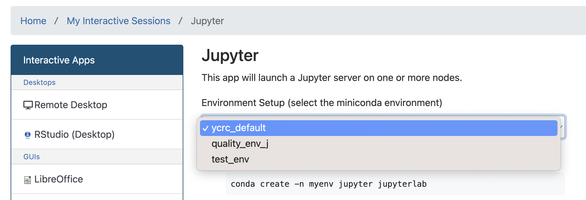

# Environments

Using environments ensures projects remain reproducible in the future. They can also solve complicated issues caused by version incompatability within a project. 

Environments are nothing more than a list of specific packages used to perform some analysis. While documenting this may seem overkill for a single project, as you work on multiple projects and projects begin to span multiple years it becomes increasingly likely that the packages you use for one project are incompatible with newer versions you used in another. If functions become depracted old code may fail to run with newer versions and often these deprecations are decisions based on stylistic changes, not indications that anything was wrong with those functions. It's often unecessary to retrofit old code because in these cases it's still correct. 

R and Python can handle environments differently. For python the easist way to manage an environment is through the `miniconda` module. 

## Creating Environments in R

This should be pretty straightforward. You should request an RStudio Server Session via the OnDemand portal. More information is available on the [YCRC website](https://docs.ycrc.yale.edu/clusters-at-yale/guides/r/).

## Creating Environments in Python 

###<span style="color:#4781BE">**Environment Setup**</span>

I recommend setting up environments using the terminal in the remote desktop interactive app. While this can be done via SSH, `miniconda` sometimes hangs when solving the environment via ssh. 

Within a terminal on Milgram type: `module load miniconda`. 

Next we will create an blank environment initialized with some name. In this case I'm going to call the environment `test_env`, but you can name it after your specific project.

`conda create -n test_env` 

We could have also added a list of packages to be installed when we created that environment by adding them after the name. For example the following would create an environment named `test_env` with python3 installed. 

`conda create -n test_env python`

After the environment is created you can install additional packages by activating it and using the install command:

`conda activate test_env`

After this step you should notice the terminal prompt changes and now indicates your active environent in parentheses before the path:

```(test_env)[al686@login1.milgram ~]```

Now we can install pacakges:

```conda install numpy matplotlib scipy jupyter pandas pyarrow```

Once you no longer need to use that environment you can leave it with 

`conda deactivate`

###<span style="color:#4781BE">**Adding Environment to Interactive Jupyter App**</span>

When developing code it can be useful to work in an interactive session, but it's important that the environment used in the interactive session is the same one used in your analysis. 

In a terminal (where you have no yet loaded miniconda) type `ycrc_conda_env.sh update`.

Once this is done, you should be able to select the environment in the dropdown setup when starting an interactive jupyter session.

 {: style="height: 200px;width: 600px;display: block; margin: 0 auto"}
