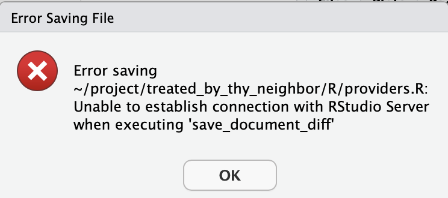

# Getting Started with T-MSIS

## Obtaining Access to T-MSIS Data
Due to the size and nature of the national data set, T-MSIS data are housed in the HIPAA-aligned [Milgram cluster](https://docs.ycrc.yale.edu/clusters/milgram/) at Yale Center for Research Computing. The first step is to [request an account](https://research.computing.yale.edu/support/hpc/account-request).

1. Make sure Anthony is aware you are requesting an account as he will need to approve the request.
2. Fill out the form
	- Department or School: Yale School of Public Health
	- Are you a Principal Investigator: No
	- Principal Investigator: Chima Ndumele
	- Clusters: Milgram
	- Special Requests: request access to the `medicaid` group.


## Using Milgram

Once you've obtained access, sign into [Milgram OnDemand](https://ood-milgram.ycrc.yale.edu/). You may need to be connected to the Yale VPN even if you're on the Yale Secure Wi-Fi.

There are three ways you'll regularly interact with Milgram.

### Terminal

You'll use the terminal to run larger jobs and perhaps to explore files. You can open the terminal by clicking "clusters" and "Milgram shell access" in the OnDemand browser, by opening a Remote Desktop on Milgram OnDemand, or by [setting up an SSH connection](https://docs.ycrc.yale.edu/clusters-at-yale/access/ssh/) from your machine.

Open the terminal (however you choose) and type `groups`. You should see `medicaid`; if you don't try typing `groups your_net_id`. If you still don't see `medicaid`, your request for access was not honored and you should contact Anthony. You won't have access to the Medicaid data until your permissions are updated.

To make your life easier, you may want to add a symlink at your home directory to the `medicaid_lab` folder. You can do this by typing `ln -s /gpfs/milgram/pi/medicaid_lab /home/your_net_id` (replace `your_net_id`!). This isn't necessary but may be helpful.

### File Explorer

You'll probably want to peruse the Medicaid lab files. Open OnDemand, then click on Files -> Home Directory in the navbar. That should take you to `/home/your_net_id/`. If you set up the symlink correctly, you should be able to click on `medicaid_lab`. If not, click "change directory" and enter `/gpfs/milgram/pi/medicaid_lab/`.

!!! warning "Don't download files"

    It's easy—too easy—to accidentally begin downloading a file in the explorer. T-MSIS data are only allowed to live on Milgram, so do not download them. Furthermore, don't download any files with information that could possibly recreate, or expose, individual-level claims data. 
    
    ALWAYS double check jupyter notebooks, log files, error messages, or other exploratory output to ensure there is no individual data being displayed before sharing beyond Milgram.
    
    Only connect to Milgram on your official Yale Laptop. These are HIPAA compliant and encrypted as an additional layer of protection if a file download is ever initiated.
    

You can also use the Remote Desktop app to explore files. The interface isn't as nice, but it's good to be careful.

### Coding

Start your first project as a subfolder in `/home/your_net_id/project/`. Keep in mind that this is actually a symlink to `/gpfs/milgram/project/ndumele/your_net_id/`.

Then, choose your preferred OnDemand app and start coding! Most work at the lab is conducted in R (use RStudio Server) or Python (use Jupyter).

For most T-MSIS tasks, the interactive session has enough computing power to work on one year of data in a smaller state, e.g., South Dakota in 2018. When starting your session, you should be able to request six hours of one CPU core with 30 GB of RAM. You can request OnDemand sessions with more cores and/or memory if you use the `day` or `week` partition. When you want to run your production analyses, you should [submit a job with SLURM](https://docs.ycrc.yale.edu/clusters-at-yale/job-scheduling/).

## Accessing storage@yale on Milgram

Certain drives on storage@yale are also suitable for hisk-risk data, and in rare cases we may need to transfer data between these. To connect to storage@yale on Milgram:

- Begin a remote desktop session (Note: the file transfer will need to complete within the allotted time, you can reach out to YCRC to request a long session)
- Open a file browser, click the pen and pencil icon next to the "Location" navigation, type `smb://storage.yale.edu/home/` and press enter
- This should open a dialogue box:
     - Select: registered user   
     - ID: `your_NET_ID`
     - Change SAMBA to YALE
     - password is your normal netID password
- Once you log in you should see the shares associated with your account 
- You can open another file browser and "drag and drop" files between the two drives


## T-MSIS Tech Stack

The [Documentation](tmsis_medicaid_data.md#documentation) section in the T-MSIS Medicaid Data page describes the T-MSIS data. After reading that, you'll want to familiarize yourself with the specific tech stack we use at the Medicaid lab.

We store all our data in parquet files. R programmers can use the `arrow` package to connect to these files, and Python programmers can use `pyarrow`.

If you haven't used Arrow or the parquet format before, first read [Hadley Wickham's introduction](https://r4ds.hadley.nz/arrow). The exercises are quite helpful. You may find the following material helpful additional reading:

- [Function reference](https://arrow.apache.org/docs/r/reference/acero.html)
- [A workshop notebook](https://arrow-user2022.netlify.app/hello-arrow.html)
- [An online book by Apache](https://arrow.apache.org/cookbook/r/)
- [The R `arrow` package page](https://arrow.apache.org/docs/r/)

## Tips and Tricks

- When working in a Milgram OnDemand session, you will occasionally need to reauthenticate. This can happen every hour or two, even if you're working the entire time.

    {: style="height: 200px;width: 400px;display: block; margin: 0 auto"}

    An error saving a file is a big hint that you need to reauthenticate. Click "Ok," then navigate to the Milgram OnDemand "My Interactive Sessions" page in another tab. Refresh that page and reauthenticate. You can then re-join your RStudio Server session and get back to work.

- If you're working on a large task in an RStudio Server session, you may see this error message:
    
	```
	Error in `get_result(output = out, options)`: ! callr subprocess failed: could not start R, exited with non-zero status, has crashed or was killed ℹ See `$stderr` for standard error.
	```
    
	This often implies that you have not allocated enough memory to the task. You could start a new interactive session with more memory or you can submit a job with SLURM.

- You may have trouble installing R packages. You can try [installing an older version](https://stackoverflow.com/questions/17082341/how-to-downgrade-an-r-package-by-installing-an-older-version) from the CRAN archive, or you can try installing from R Universe.

## Useful SLURM Commands

To submit a job, you'll need a [shell script that runs your code](https://docs.ycrc.yale.edu/clusters-at-yale/job-scheduling/slurm-examples/).

You'll generally submit batch jobs using the terminal. `cd` to the folder with the shell script, then type `sbatch submit.sh` (assuming your shell script is called `submit.sh`). You should receive an email from no-reply@milgram.ycrc.yale.edu when the job starts and when it finishes or fails for any reason (error in the code, invalid configuration, ran out of memory, etc.).

Most jobs should start immediately. If you still haven't received that "job started" email, you're probably in the queue. This is usually a result of you requesting a lot of resources _and_ many other users running their own computationally expensive tasks.

First, run `squeue --me` to make sure your job went through. You should see `(Resources)` in the right-most column, which indicates that your job is waiting on compute or memory availability.

Then, run `squeue -p [partition_name]` to see who else is using Milgram. (`partition_name` can be `day`, `week`, etc.) Check the [Milgram user guide](https://docs.ycrc.yale.edu/clusters/milgram/) to see the total available compute nodes. If you sum up the existing jobs, you'll probably see that your job would fall over the limits.

You can cancel a job if necessary with `scancel [job_id]`. The cluster will tell you your `job_id` when you submit it, and you can also find it in your queue. If you lose your `job_id`, run `sacct -X --start now-3hours -o jobid,jobname,start`, adjusting `3hours` to whatever is necessary to capture the start time.

To get the stats of a job, run `jobstats [job_id]`. This is helpful if you want to maximize parallelization with constrained memory.

### Finding Available Resources

If your job is stuck in queue, the first thing to consider is if you really need all the resources you requested. If you don't have any [parallelization](../data_science/parallelization.md) in your code, you probably only need one core. Similarly, if you're not working with large datasets, you shouldn't need 181 GB of memory. Requesting only what you need helps you get your job running sooner and is [considerate](https://research.computing.yale.edu/services/support-high-performance-computing/hpc-policies#Compute) of others on the cluster.

Need what you requested? You might be stuck waiting. If you can reduce your request, continue reading.

!!! warning "Some guesswork"

    Some of the information in this subsection may not be entirely accurate. Computing is hard! When in doubt, reach out to the [YCRC support desk](https://research.computing.yale.edu/support).

When you run `squeue -p [partition_name]`, look at the values in the `NODELIST(REASON)` column. Jobs in progress will have a node ID, while queued jobs will have a reason in parentheses, e.g., `(Resources)`.

Say I'm submitting a job requesting one node and all 36 cores, but I'm stuck in the queue. First, I will look at the existing jobs. If all the jobs on one node look like they'll finish soon, perhaps I'll wait in the queue. But if the jobs have another few days, it may be faster to reduce my requested resources.

To see how much you need to reduce your resources, run `scontrol show node [node_id]` with one of the `node_id` values from `squeue -p [partition_name]`. The `CfgTRES` row of the output shows the maximum values, and the `AllocTRES` shows what's in use. Subtract `AllocTRES` from `CfgTRES` to see what's available.

## Getting Help

It takes some time to get started, but there are many resources to help. Anthony and other folks at the lab can assist with most questions, which you can ask individually or through the Medicaid lab's T-MSIS Slack channel. Issues with Milgram—including access, permissions, package installation errors, and code execution—can be directed to the [YCRC support desk](https://research.computing.yale.edu/support).
